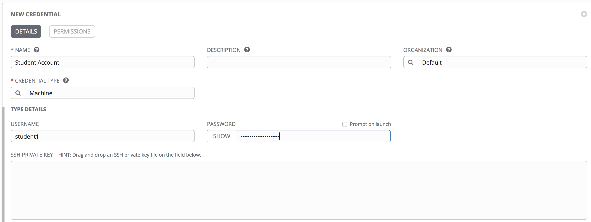
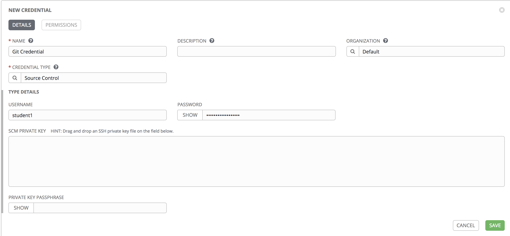
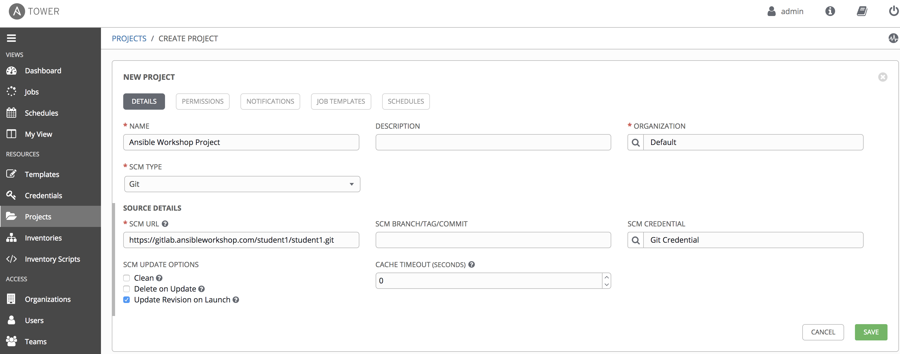
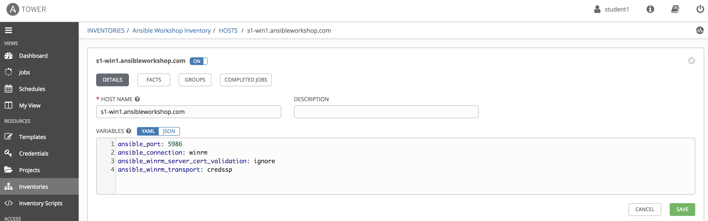
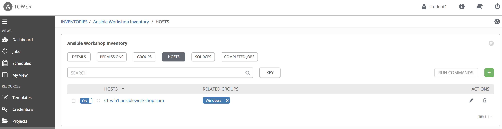

include::header.adoc[]

= Exercise 1 - Configuring Ansible Tower

In this exercise, we are going to configure Tower so that we can run a playbook.

== Configuring Ansible Tower

There are a number of constructs in the Ansible Tower UI that enable multi-tenancy, notifications, scheduling, etc.
However, we are only going to focus on a few of the key constructs that are required for this workshop today.

* Credentials
* Projects
* Inventory
* Job Template

== Logging into Tower

You will find a shortcut on your desktop named "Ansible Tower", click this to open your personal Ansible Tower instance in Chrome.

Your Tower instance has already been pre-configured for LDAP Login, so use your student credentials without the domain name to login.

Your Ansible Tower license has already been applied for you, so after logging in you should now see the Dashboard.

== Creating a Machine Credential

Credentials are utilized by Tower for authentication when launching jobs against machines,
synchronizing with inventory sources, and importing project content from a version control system.

There are many link:http://docs.ansible.com/ansible-tower/latest/html/userguide/credentials.html#credential-types[types of credentials] 
including machine, network, and various cloud providers.  In this workshop, we are using a *machine* credential.

=== Step 1:

Select CREDENTIALS from the left hand panel under resources     

image:images/credentials.png[Cred,200,400]

=== Step 2:

Click on the image:images/add.png[Add,35,25] icon and add new credential     

=== Step 3:

Complete the form using the following entries:

|===
|NAME |Student Account
|DESCRIPTION|
|ORGANIZATION|Default
|TYPE|Machine
|USERNAME| <your USER ID - instructor provided (ie. domain_name\student1)>
|PASSWORD| <your AD account password - instructor provided>
|===

=== Step 4:

Select SAVE     image:images/at_save.png[Save,35,25] +

== Create an SCM Credential

Our first credential was to access our Windows machines.  We need another to access our source code repository.  Repeat the process as above, but with the following details:

|===
|NAME |Git Credential
|DESCRIPTION|SCM credential for playbook sync
|ORGANIZATION|Default
|TYPE|Source Control
|USERNAME| <your USER ID - instructor provided (ie. student1)>
|PASSWORD| <your AD account password - instructor provided>
|===

Make sure you select SAVE!

== Creating a Project

A Project is a logical collection of Ansible playbooks, represented in Tower.
You can manage playbooks and playbook directories by either placing them manually
under the Project Base Path on your Tower server, or by placing your playbooks into
a source code management (SCM) system supported by Tower, including Git, Subversion, and Mercurial.

=== Step 1:

Click on PROJECTS on the left hand panel.

image:images/project.png[Proj,200,400]

=== Step 2:

Click on the image:images/add.png[Add,35,25] icon and add new project  

=== Step 3:

Complete the form using the following entries (*using your student number in SCM URL*)

|===
|NAME |Ansible Workshop Project
|DESCRIPTION|workshop playbooks
|ORGANIZATION|Default
|SCM TYPE|Git
|SCM URL|https://gitlab.ansibleworkshop.com/student#/student#.git
|SCM BRANCH|
|SCM CREDENTIAL|Git Credential
|SCM UPDATE OPTIONS
a|

- [ ] Clean
- [ ] Delete on Update
- [*] Update on Launch
|===

=== Step 4:

Select SAVE     image:images/at_save.png[Save,35,25]

== Inventories

An inventory is a collection of hosts against which jobs may be launched.
Inventories are divided into groups and these groups contain the actual hosts.
Inventories may be sourced manually, by entering host names into Tower, or from one
of Ansible Tower's supported cloud providers.

A static Inventory has already been created for you today.  We will now take a look at this inventory to show case the various features.

=== Step 1:

Click on INVENTORIES from the left hand panel.  You will see the preconfigured Inventory listed.  Click on the Inventories' name *Ansible Workshop Inventory* or on the Edit button. image:images/at_edit.png[Edit,35,35]

=== Step 2:

You will now be viewing the Inventory.  From here you can add Hosts, Groups, or even add Variables specific to this Inventory.

We will be viewing the hosts, so click on the *HOSTS* button.

=== Step 3:

In the Hosts view, we can see every host associated with with this inventory.  You will also see which groups a host is associated with.
Hosts can be associated with multiple groups.  These groups can later then be used to narrow down to the exact hosts we will later run our playbooks on.

=== Step 4:

If you click on the Host's name or on the Edit Button image:images/at_edit.png[Edit,35,35] we will be able to look at variables specific to this host.

Today we have already setup various variables to tell Ansible that this host is a Windows machine.  You do not have to define these variables as a Host variable here, 
they could also be Group variables or reside directly in your Template or Playbook.  We will place them here for simplicities sake.
By default Ansible will attempt to use SSH to connect to any Host, so for Windows we need to tell it utilize a different connection method.

*ansible_connection: winrm*

In our example we tell Ansible to connect to the WinRM SSL Port 5986.  The nonSSL port runs on 5985 but is unecrypted.

*ansible_port: 5986*

We also tell Ansible to ignore the WinRM cert, since our lab doesn't have a proper certificate store setup.

*ansible_winrm_server_cert_validation: ignore*

Windows also has various authentication methods that we can utlize to connect.  Here we tell Ansible to use the *CredSSP* Transport Method to authenticate to our Windows host.

*ansible_winrm_transport: credssp*

You can find more information about these and other settings in our link:https://docs.ansible.com/ansible/latest/user_guide/windows.html[Windows Guides].
The authentication settings are particularly important and you will need to review them and decide which method is best for your needs.

=== End Result

At this point, we are done with our basic configuration of Ansible Tower.  In exercise 2, we will now run a few Ad-Hoc commands against these hosts.
