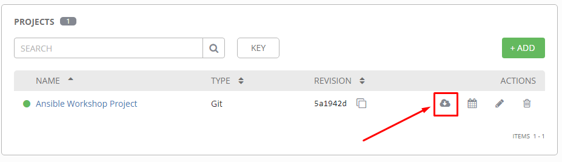
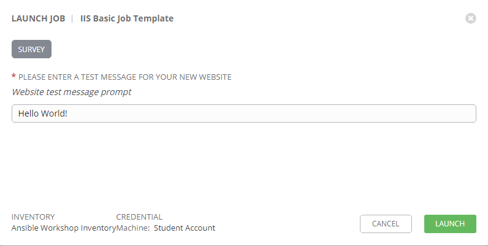
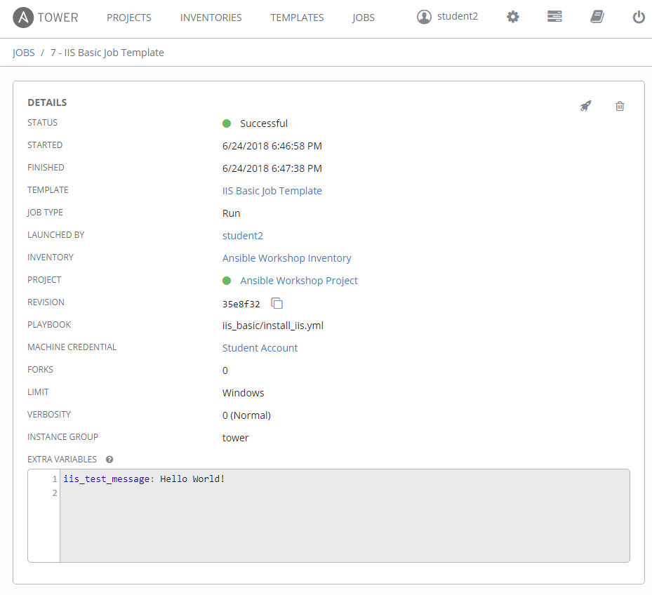

include::header.adoc[]

= Exercise 4- Creating and Running a Job Template

A job template is a definition and set of parameters for running an Ansible job.
Job templates are useful to execute the same job many times.

== Syncing your Project

Before you can create a job template with a new playbook, you must first sync your Project so that Tower knows about it.
To do this, click on *PROJECTS* and then click the cloud icon next to your project.  Once this is complete, you can create the job template.

== Creating a Job Template

=== Step 1:

Select TEMPLATES

=== Step 2:

Click on ADD image:images/at_add.png[Add,35,25], and select JOB TEMPLATE

=== Step 3:

Complete the form using the following values

|===
|NAME |IIS Basic Job Template
|DESCRIPTION|Template for the iis-basic-playbook
|JOB TYPE|Run
|INVENTORY|Ansible Workshop Inventory
|PROJECT|Ansible Workshop Project
|PLAYBOOK|iis-basic/install_iis.yml
|MACHINE CREDENTIAL|Student Account
|LIMIT|Windows
|OPTIONS
a|
- [*] Use Fact Cache
|===

image::images/4-create-job-template.png[title="Create Job Template",width=1000]

=== Step 4:

Click SAVE image:images/at_save.png[Save] and then select ADD SURVEY image:images/at_add_survey.png[Add]

=== Step 5:

Complete the survey form with following values

|===
|PROMPT|Please enter a test message for your new website
|DESCRIPTION|Website test message prompt
|ANSWER VARIABLE NAME|iis_test_message
|ANSWER TYPE|Text
|MINIMUM/MAXIMUM LENGTH| Use the defaults
|DEFAULT ANSWER| Be creative, keep it clean, we're all professionals here
|===

image::images/4-survey.png[title="Survey Form",width=1000]

=== Step 6:

Select ADD image:images/at_add.png[Add,35,25]

=== Step 7:

Select SAVE image:images/at_save.png[Add,35,25]

=== Step 8:

Back on the main Job Template page, select SAVE image:images/at_save.png[Add,35,25] again.

== Running a Job Template

Now that you've sucessfully created your Job Template, you are ready to launch it.
Once you do, you will be redirected to a job screen which is refreshing in realtime
showing you the status of the job.

=== Step 1:

Select TEMPLATES
[NOTE]
Alternatively, if you haven't navigated away from the job templates creation page, you can scroll down to see all existing job templates

=== Step 2:

Click on the rocketship icon image:images/at_launch_icon.png[Add,35,25] for the *IIS Basic Job Template*

=== Step 3:

When prompted, enter your desired test message

=== Step 4:

Select LAUNCH image:images/at_survey_launch.png[SurveyL,35,25]

=== Step 5:

Sit back, watch the magic happen

One of the first things you will notice is the summary section.  This gives you details about
your job such as who launched it, what playbook it's running, what the status is, i.e. pending, running, or complete.

Next you will be able to see details on the play and each task in the playbook.

image::images/4-job-summary-output.png[title="Play and Task Output"]

=== Step 6:

Once your job is sucessful, navigate to your new website (replace # with your student number)

[source,bash]
----
http://s#-win1.ansibleworkshop.com
----

If all went well, you should see something like this, but with your own custom message of course.

image::images/4-website-output.png[title="New Website with Personalized Test Message",width=1000]

== Extra Credit

Now that you have IIS Installed, create a new playbook called 'remove_iis.yml' to stop and remove IIS.

== End Result
At this point in the workshop, you've experienced the core functionality of Ansible Tower.  But wait... there's more!
You've just begun to explore the possibilities of Ansible Tower.  The next few lessons will help you move beyond a basic playbook.
